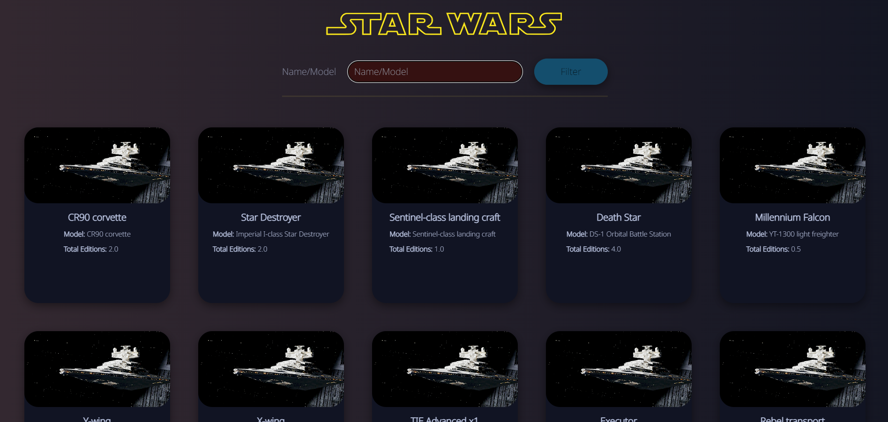
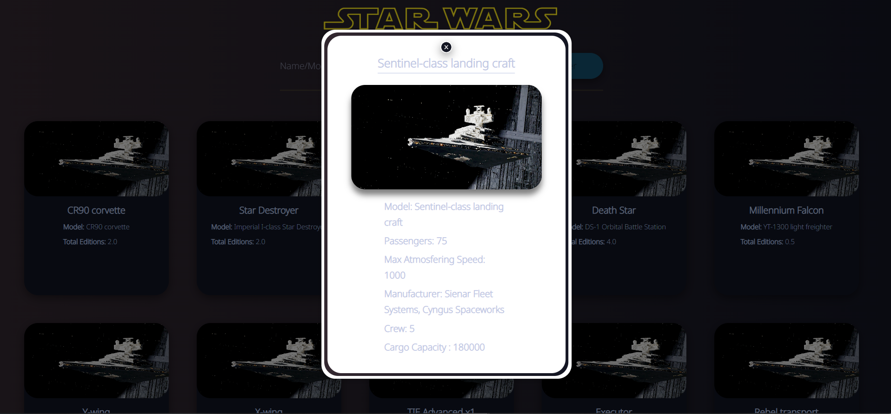
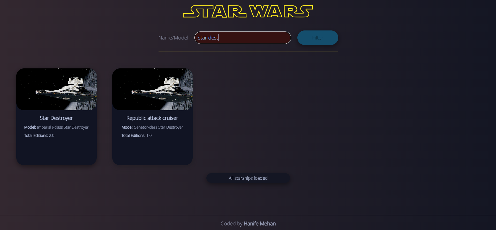
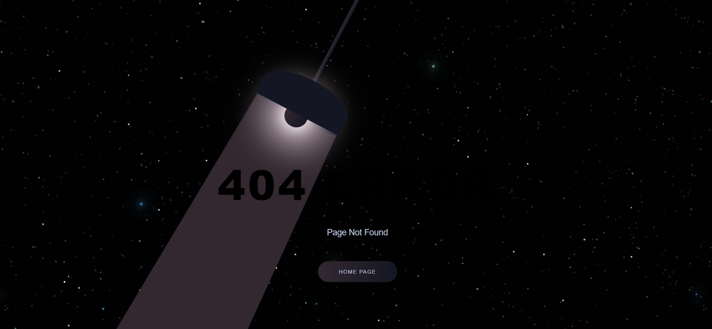

# FinalCase
Patika FMSS Front-end Practium Final Case

## Installation

1. Clone the repository
2. `yarn` command to install dependencies
3. `yarn start` command to run the application

## NETLIFY

https://star-wars-starship.netlify.app/

